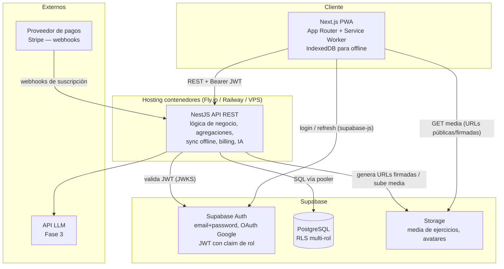

# Arquitectura técnica y plan de implementación — PWA de seguimiento de entrenamientos

**Contexto confirmado:** ~20k usuarios registrados / ~2k DAU al año 1 · 1 desarrollador (solo founder) · MVP en 12–16 semanas · Infra $50–200 USD/mes · LATAM, sin requisitos regulatorios especiales.

**Suposiciones explícitas** (corregir si alguna es incorrecta):

- S1: El mercado inicial es México/LATAM y la app se lanza solo en español.
- S2: Unidades de peso en kg (con conversión a lb como preferencia de UI, no de datos).
- S3: El catálogo de ejercicios lo cura el ADMIN; los usuarios no crean ejercicios propios en el MVP.
- S4: "Media demostrativa" en MVP = imagen estática o GIF/MP4 corto (<10 MB), sin streaming adaptativo.
- S5: No se requiere borrado de cuenta conforme a GDPR, pero se implementa igualmente por buena práctica (LFPDPPP en México lo agradece).

---

## 1. Preguntas abiertas

Decisiones que requieren tu confirmación antes de avanzar a implementación:

1. **Proveedor de pagos.** Recomiendo Stripe (ver §2, tabla comparativa), pero si el público objetivo paga mayoritariamente con OXXO/transferencia SPEI, Mercado Pago cambia la ecuación. ¿Tarjeta internacional es aceptable como único método en Fase 3?
2. **Origen de la media del catálogo.** ¿Producirás tus propias imágenes/videos, licenciarás un dataset existente, o empezamos con un catálogo reducido (~50 ejercicios) con media propia? Impacta costo, tiempo y riesgo legal (ver §8, R3).
3. **Hosting del backend NestJS.** Propongo contenedor OCI en Fly.io o Railway (tabla en §2). ¿Tienes preferencia o un VPS existente donde correr Podman en producción?
4. **Proveedor de IA (Fase 3).** ¿Alguna preferencia de proveedor LLM? El diseño lo abstrae detrás de un módulo NestJS, pero conviene decidirlo antes de la Fase 3 para estimar costo por usuario PRO. No incluyo precios porque cambian con frecuencia: verificar en la página del proveedor al llegar a esa fase.
5. **Política de visibilidad por defecto.** ¿Los perfiles y entrenamientos nacen privados y el usuario opta por publicar (recomendado), o públicos por defecto como Hevy? Afecta RLS y el diseño del feed.

---

## 2. Arquitectura general



### Componentes y responsabilidades

| Componente | Responsabilidad | Por qué ahí |
|---|---|---|
| **Next.js PWA** | UI, instalabilidad, captura offline de entrenamientos, cola de sincronización (outbox en IndexedDB), sesión vía supabase-js | El App Router permite RSC para páginas públicas (perfiles, feed) y client components para el logger de entrenamiento, que es 100 % interactivo |
| **NestJS API** | Toda la lógica de negocio: CRUD validado, agregaciones de analytics, endpoint de sincronización batch, procesamiento de webhooks de billing, orquestación de IA, rate limiting | Estas operaciones requieren transacciones multi-tabla, cálculos y secretos (Stripe, LLM) que no deben vivir en el cliente ni expresarse solo con RLS |
| **Supabase Auth** | Registro, login, OAuth, emisión y rotación de JWT, hook de token para inyectar el claim `user_role` | Evita construir auth a mano; el JWT es verificable por NestJS sin llamada de red (JWKS) |
| **Supabase PostgreSQL** | Persistencia; RLS como segunda capa de autorización | Restricción del proyecto; RLS actúa como red de seguridad aunque el tráfico pase por NestJS |
| **Supabase Storage** | Media del catálogo (bucket público con CDN) y avatares; fotos de entrenamientos privadas vía URLs firmadas | Restricción del proyecto; el cliente lee media directo de Storage sin pasar por NestJS |
| **Stripe (propuesto)** | Checkout, portal de cliente, ciclo de vida de suscripción vía webhooks | Ver comparativa abajo |

### Frontera Supabase vs. NestJS (regla de diseño)

- **Supabase** es *infraestructura*: identidad, datos, archivos. El cliente le habla directamente solo para (a) auth y (b) descargar media.
- **NestJS** es la *única puerta de escritura y lectura de datos de negocio*. Se conecta con credencial privilegiada, pero cada request ejecuta autorización explícita (guards + ownership checks). RLS queda activa en todas las tablas como defensa en profundidad y habilita, si en el futuro conviene, lecturas directas cliente→Postgres sin rediseñar seguridad.
- Justificación para un solo dev: un único punto de autorización de negocio (NestJS) es más fácil de razonar y testear que repartir lógica entre Edge Functions, RLS compleja y cliente.

### Decisión: hosting del backend

| Opción | Ventaja | Costo |
|---|---|---|
| **Fly.io / Railway (contenedor OCI)** ✅ | Deploy desde GitHub Actions con la misma imagen que corre en Podman local; escala vertical simple; TLS y dominios resueltos | Bajo a la escala prevista (verificar precios vigentes; no los invento) |
| VPS + Podman + systemd | Control total, costo fijo predecible | Tú eres el SRE: parches, TLS, monitoreo — caro en tiempo para un solo dev |
| Supabase Edge Functions | Cero infra extra | Rompe la restricción "backend NestJS"; Deno ≠ Node; descartada |

**Recomendación:** plataforma de contenedores gestionada. La imagen OCI construida para Podman local es exactamente la que se despliega: paridad dev/prod sin costo de operación.

### Decisión: proveedor de pagos (Fase 3, se decide ahora por diseño)

| Opción | Ventaja | Costo/limitación |
|---|---|---|
| **Stripe** ✅ | Suscripciones maduras (Checkout, Customer Portal, webhooks bien documentados), opera en México | Métodos locales (OXXO) no soportan suscripciones recurrentes de forma nativa; comisiones a verificar |
| Mercado Pago | Métodos de pago locales LATAM muy fuertes | API de suscripciones menos ergonómica; más código propio de reconciliación |

**Recomendación:** Stripe, salvo que la pregunta abierta #1 indique lo contrario. El diseño aísla el proveedor en un `BillingModule` con webhooks, así el cambio posterior es acotado.

---

## 3. Modelo de datos

Esquema PostgreSQL (DDL). Convenciones: `uuid` como PK (los de `workouts` los genera el **cliente** para soportar offline), `timestamptz` siempre, borrado lógico solo donde aporta.

```sql
-- ===== Enums =====
create type app_role as enum ('ADMIN', 'PRO', 'FREE');
create type muscle_group as enum (
  'chest','back','shoulders','biceps','triceps','forearms',
  'quads','hamstrings','glutes','calves','core','full_body','cardio'
);
create type equipment_type as enum (
  'barbell','dumbbell','machine','cable','bodyweight','kettlebell','band','cardio_machine','other'
);
create type subscription_status as enum ('active','past_due','canceled','incomplete');

-- ===== Perfiles (1:1 con auth.users) =====
create table public.profiles (
  id           uuid primary key references auth.users(id) on delete cascade,
  username     text not null unique check (username ~ '^[a-z0-9_]{3,30}$'),
  display_name text,
  avatar_url   text,
  role         app_role not null default 'FREE',
  is_public    boolean not null default false,
  created_at   timestamptz not null default now()
);

-- ===== Catálogo de ejercicios (curado por ADMIN) =====
create table public.exercises (
  id            uuid primary key default gen_random_uuid(),
  name          text not null,
  description   text,
  muscle_group  muscle_group not null,
  secondary_muscles muscle_group[] not null default '{}',
  equipment     equipment_type not null,
  media_url     text,            -- objeto en Storage (bucket público 'exercise-media')
  media_type    text check (media_type in ('image','video')),
  is_active     boolean not null default true,
  created_at    timestamptz not null default now()
);
create index idx_exercises_muscle on public.exercises (muscle_group) where is_active;
create index idx_exercises_equipment on public.exercises (equipment) where is_active;

-- ===== Rutinas (plantillas) =====
create table public.routines (
  id          uuid primary key default gen_random_uuid(),
  owner_id    uuid not null references public.profiles(id) on delete cascade,
  name        text not null,
  description text,
  is_public   boolean not null default false,          -- Fase 2
  copied_from uuid references public.routines(id) on delete set null, -- Fase 2
  created_at  timestamptz not null default now(),
  updated_at  timestamptz not null default now()
);
create index idx_routines_owner on public.routines (owner_id);

create table public.routine_exercises (
  id          uuid primary key default gen_random_uuid(),
  routine_id  uuid not null references public.routines(id) on delete cascade,
  exercise_id uuid not null references public.exercises(id),
  position    smallint not null,
  notes       text,
  unique (routine_id, position)
);
create index idx_re_routine on public.routine_exercises (routine_id);

create table public.routine_sets (
  id                  uuid primary key default gen_random_uuid(),
  routine_exercise_id uuid not null references public.routine_exercises(id) on delete cascade,
  position            smallint not null,
  target_reps         smallint check (target_reps between 1 and 100),
  target_weight_kg    numeric(6,2) check (target_weight_kg >= 0),
  target_rpe          numeric(3,1) check (target_rpe between 1 and 10),
  unique (routine_exercise_id, position)
);

-- ===== Entrenamientos (sesiones ejecutadas) =====
-- id generado por el CLIENTE (uuid v4) => idempotencia en sync offline
create table public.workouts (
  id               uuid primary key,
  user_id          uuid not null references public.profiles(id) on delete cascade,
  routine_id       uuid references public.routines(id) on delete set null,
  title            text not null default 'Entrenamiento',
  notes            text,
  started_at       timestamptz not null,
  ended_at         timestamptz,
  duration_seconds int generated always as
    (case when ended_at is null then null
          else extract(epoch from (ended_at - started_at))::int end) stored,
  client_updated_at timestamptz not null,   -- reloj lógico para LWW en sync
  created_at       timestamptz not null default now(),
  check (ended_at is null or ended_at >= started_at)
);
create index idx_workouts_user_date on public.workouts (user_id, started_at desc);

create table public.workout_exercises (
  id          uuid primary key,             -- también generado por cliente
  workout_id  uuid not null references public.workouts(id) on delete cascade,
  exercise_id uuid not null references public.exercises(id),
  position    smallint not null,
  unique (workout_id, position)
);
create index idx_we_workout on public.workout_exercises (workout_id);

create table public.workout_sets (
  id                  uuid primary key,     -- también generado por cliente
  workout_exercise_id uuid not null references public.workout_exercises(id) on delete cascade,
  position            smallint not null,
  reps                smallint not null check (reps between 0 and 200),
  weight_kg           numeric(6,2) not null default 0 check (weight_kg >= 0),
  rpe                 numeric(3,1) check (rpe between 1 and 10),
  is_completed        boolean not null default true,
  unique (workout_exercise_id, position)
);

-- ===== Social (Fase 2) =====
create table public.follows (
  follower_id uuid not null references public.profiles(id) on delete cascade,
  followee_id uuid not null references public.profiles(id) on delete cascade,
  created_at  timestamptz not null default now(),
  primary key (follower_id, followee_id),
  check (follower_id <> followee_id)
);
create index idx_follows_followee on public.follows (followee_id);

create table public.posts (
  id         uuid primary key default gen_random_uuid(),
  user_id    uuid not null references public.profiles(id) on delete cascade,
  workout_id uuid not null references public.workouts(id) on delete cascade,
  caption    text,
  created_at timestamptz not null default now(),
  unique (workout_id)                        -- un workout se publica una sola vez
);
create index idx_posts_feed on public.posts (created_at desc);

-- ===== Billing (Fase 3) =====
create table public.subscriptions (
  id                       uuid primary key default gen_random_uuid(),
  user_id                  uuid not null references public.profiles(id) on delete cascade,
  provider                 text not null default 'stripe',
  provider_customer_id     text not null,
  provider_subscription_id text not null unique,
  status                   subscription_status not null,
  current_period_end       timestamptz not null,
  created_at               timestamptz not null default now(),
  updated_at               timestamptz not null default now()
);
create index idx_subs_user on public.subscriptions (user_id);
```

### Políticas RLS (modelo multi-rol)

El rol viaja como claim `user_role` en el JWT (inyectado por un Custom Access Token Hook de Supabase Auth que lee `profiles.role`). Helper:

```sql
create or replace function public.jwt_role() returns app_role
language sql stable as $$
  select coalesce(
    (current_setting('request.jwt.claims', true)::jsonb ->> 'user_role')::app_role,
    'FREE'
  );
$$;

alter table public.profiles         enable row level security;
alter table public.exercises        enable row level security;
alter table public.routines         enable row level security;
alter table public.routine_exercises enable row level security;
alter table public.routine_sets     enable row level security;
alter table public.workouts         enable row level security;
alter table public.workout_exercises enable row level security;
alter table public.workout_sets     enable row level security;
alter table public.follows          enable row level security;
alter table public.posts            enable row level security;
alter table public.subscriptions    enable row level security;

-- Perfiles: leo el mío, los públicos, o todo si soy ADMIN; solo edito el mío (sin tocar role)
create policy profiles_select on public.profiles for select
  using (id = auth.uid() or is_public or public.jwt_role() = 'ADMIN');
create policy profiles_update on public.profiles for update
  using (id = auth.uid()) with check (id = auth.uid());
-- El cambio de role se hace SOLO vía service role (backend), nunca por política.

-- Catálogo: lectura para todos los autenticados; escritura solo ADMIN
create policy exercises_select on public.exercises for select
  using (auth.role() = 'authenticated');
create policy exercises_admin_write on public.exercises for all
  using (public.jwt_role() = 'ADMIN') with check (public.jwt_role() = 'ADMIN');

-- Rutinas: dueño CRUD; lectura adicional si es pública (Fase 2)
create policy routines_owner_all on public.routines for all
  using (owner_id = auth.uid()) with check (owner_id = auth.uid());
create policy routines_public_read on public.routines for select
  using (is_public);

-- Hijos de rutina heredan por EXISTS sobre la rutina padre
create policy re_by_parent on public.routine_exercises for all
  using (exists (select 1 from public.routines r
                 where r.id = routine_id
                   and (r.owner_id = auth.uid() or r.is_public)))
  with check (exists (select 1 from public.routines r
                      where r.id = routine_id and r.owner_id = auth.uid()));
-- (política análoga para routine_sets vía routine_exercises)

-- Workouts: dueño CRUD; lectura ajena solo si está publicado y el perfil es público
create policy workouts_owner_all on public.workouts for all
  using (user_id = auth.uid()) with check (user_id = auth.uid());
create policy workouts_posted_read on public.workouts for select
  using (exists (select 1 from public.posts p
                 join public.profiles pr on pr.id = public.workouts.user_id
                 where p.workout_id = public.workouts.id and pr.is_public));
-- (políticas análogas de lectura para workout_exercises / workout_sets vía workout padre)

-- Social
create policy follows_read   on public.follows for select using (auth.role() = 'authenticated');
create policy follows_manage on public.follows for all
  using (follower_id = auth.uid()) with check (follower_id = auth.uid());
create policy posts_read   on public.posts for select using (auth.role() = 'authenticated');
create policy posts_manage on public.posts for all
  using (user_id = auth.uid()) with check (user_id = auth.uid());

-- Billing: el usuario solo lee su suscripción; escritura solo service role (webhooks)
create policy subs_read_own on public.subscriptions for select using (user_id = auth.uid());
```

Notas:

- Las políticas "análogas" omitidas siguen el mismo patrón `EXISTS` hacia el padre; se incluirán completas en las migraciones.
- `duration_seconds` es columna generada: nadie puede falsear la duración respecto a los timestamps.
- Migraciones versionadas con Supabase CLI dentro del monorepo (`supabase/migrations/`), aplicadas por CI.

---

## 4. Contratos de API

Base: `https://api.<dominio>/v1`. Autenticación: `Authorization: Bearer <JWT de Supabase>` salvo indicación. Errores estándar: `400` validación, `401` sin token, `403` sin permiso/rol, `404` no existe o no visible, `409` conflicto, `429` rate limit.

### Auth

El registro/login ocurre **cliente ↔ Supabase Auth** (no pasa por NestJS). El backend solo expone:

| Método | Ruta | Payload | Respuestas |
|---|---|---|---|
| POST | `/auth/onboarding` | `{ username, display_name? }` — crea `profiles` tras primer login | `201`, `409` username tomado |
| GET | `/me` | — | `200 { profile, role, subscription_status }` |
| PATCH | `/me` | `{ display_name?, avatar_url?, is_public? }` | `200` |
| DELETE | `/me` | — (borrado de cuenta, cascada) | `204` |

### Exercises

| Método | Ruta | Payload | Respuestas |
|---|---|---|---|
| GET | `/exercises` | query: `muscle_group?, equipment?, q?, cursor?` | `200` lista paginada |
| GET | `/exercises/:id` | — | `200`, `404` |
| POST | `/exercises` | `{ name, description?, muscle_group, equipment, media_type? }` **ADMIN** | `201`, `403` |
| PATCH | `/exercises/:id` | campos parciales **ADMIN** | `200`, `403` |
| DELETE | `/exercises/:id` | soft-delete (`is_active=false`) **ADMIN** | `204`, `403` |
| POST | `/exercises/:id/media-upload-url` | `{ content_type }` → URL firmada de subida **ADMIN** | `200`, `403` |

### Routines

| Método | Ruta | Payload | Respuestas |
|---|---|---|---|
| GET | `/routines` | query: `cursor?` (propias) | `200` |
| GET | `/routines/:id` | — (propia o pública) | `200`, `404` |
| POST | `/routines` | `{ name, description?, exercises: [{ exercise_id, position, notes?, sets: [{ position, target_reps?, target_weight_kg?, target_rpe? }] }] }` | `201`, `422` límite FREE alcanzado |
| PUT | `/routines/:id` | mismo shape (reemplazo completo de la plantilla) | `200`, `403`, `404` |
| DELETE | `/routines/:id` | — | `204` |
| POST | `/routines/:id/copy` | — copia una rutina pública al perfil propio (Fase 2) | `201`, `404`, `422` |

### Workouts

| Método | Ruta | Payload | Respuestas |
|---|---|---|---|
| GET | `/workouts` | query: `from?, to?, cursor?` | `200` |
| GET | `/workouts/:id` | — | `200`, `404` |
| POST | `/workouts` | workout completo con `id` (uuid cliente), ejercicios y sets anidados, `client_updated_at` | `201`, `200` si ya existía (idempotente) |
| PUT | `/workouts/:id` | reemplazo completo + `client_updated_at` | `200`, `409` si el servidor tiene versión más nueva |
| DELETE | `/workouts/:id` | — | `204` |
| POST | `/sync/workouts` | `{ operations: [{ op: 'upsert'\|'delete', workout }] }` batch desde el outbox offline | `200 { results: [{ id, status: 'applied'\|'skipped_stale'\|'error' }] }` |

### Social (Fase 2)

| Método | Ruta | Payload | Respuestas |
|---|---|---|---|
| GET | `/feed` | query: `cursor?` — posts de seguidos, orden cronológico inverso | `200` |
| POST | `/posts` | `{ workout_id, caption? }` | `201`, `409` ya publicado |
| DELETE | `/posts/:id` | — | `204` |
| GET | `/users/:username` | perfil público + últimos posts | `200`, `404` |
| POST | `/users/:username/follow` | — | `204` |
| DELETE | `/users/:username/follow` | — | `204` |

### Analytics

| Método | Ruta | Payload | Respuestas |
|---|---|---|---|
| GET | `/analytics/volume` | query: `weeks=12` → volumen (kg×reps) por semana | `200` |
| GET | `/analytics/distribution` | query: `from?, to?, by=muscle_group\|equipment` | `200` |
| GET | `/analytics/prs` | PRs por ejercicio (mejor peso×reps, 1RM estimado) | `200` |
| GET | `/analytics/exercise/:id/history` | series históricas de un ejercicio | `200` |
| GET | `/analytics/weekly-summary` | query: `week?=YYYY-MM-DD` (lunes; por defecto la última semana completa) → sesiones vs objetivo, volumen vs anterior, PRs y medallas de la semana, racha | `200` / `400` semana en curso o no lunes |
| GET | `/me/achievements` | catálogo de logros con `earned_at` y `progress {current, target}` de los bloqueados | `200` / `404` sin onboarding |

### Billing (Fase 3)

| Método | Ruta | Payload | Respuestas |
|---|---|---|---|
| POST | `/billing/checkout-session` | `{ plan: 'pro_monthly'\|'pro_yearly' }` → `{ checkout_url }` | `200` |
| POST | `/billing/portal-session` | — → `{ portal_url }` | `200` |
| POST | `/billing/webhooks/stripe` | evento Stripe firmado (**sin** Bearer; verificación de firma) | `200`, `400` firma inválida |
| GET | `/billing/subscription` | — | `200` |

---

## 5. Estrategia de autenticación y autorización

### Flujo de autenticación

1. **Registro/Login:** el cliente usa `supabase-js` (email+password y OAuth Google). Supabase emite `access_token` (JWT, vida corta) + `refresh_token`; la librería gestiona la rotación.
2. **Claim de rol:** un **Custom Access Token Hook** en Supabase lee `profiles.role` y añade `user_role` al JWT. Así el rol es verificable sin consultar la BD en cada request.
3. **Onboarding:** tras el primer login, el cliente llama `POST /auth/onboarding`; NestJS crea la fila en `profiles` (rol `FREE`).
4. **Requests a la API:** el cliente envía `Authorization: Bearer <access_token>`. NestJS valida firma y expiración contra el **JWKS público de Supabase** (sin round-trip de red por request, con caché de claves).

### Autorización por capas

| Capa | Mecanismo | Qué decide |
|---|---|---|
| **NestJS — AuthGuard** | Verificación JWT (JWKS) | ¿Quién eres? Inyecta `userId` y `role` en el request |
| **NestJS — RolesGuard** | Decorador `@Roles('ADMIN')` / `@Roles('PRO','ADMIN')` | ¿Tu rol permite este endpoint? (403) |
| **NestJS — Servicios** | Ownership checks + límites de plan | ¿Este recurso es tuyo? ¿Tu plan permite crear otra rutina / usar IA? (403/422) |
| **PostgreSQL — RLS** | Políticas de §3 | Red de seguridad: aunque un bug del backend construya mal una query, la BD no expone filas ajenas cuando la petición lleva contexto de usuario |
| **Storage** | Bucket público (catálogo) + URLs firmadas (privado) | Acceso a archivos sin exponer rutas privadas |

### Aplicación de roles

- **ADMIN:** gestión del catálogo de ejercicios y (futuro) moderación. Se asigna manualmente vía backend con service role; ninguna política permite auto-promoción. El claim del JWT lo propaga.
- **PRO:** desbloqueado por webhook de Stripe (`checkout.session.completed` → `role='PRO'`; `customer.subscription.deleted` / impago → `role='FREE'`). Tras el cambio, el backend fuerza refresh de sesión para regenerar el JWT con el claim nuevo. Gatea: endpoints de IA (`@Roles('PRO','ADMIN')`) y límites ampliados (p. ej. rutinas ilimitadas vs. tope FREE — el tope exacto es decisión de producto, marcado como configurable).
- **FREE:** rol por defecto. Acceso completo al núcleo con límites de plan aplicados en la capa de servicios (una sola fuente de verdad: `PlanLimitsService` en NestJS, no duplicar límites en RLS).

**Ventana de desincronización asumida:** el claim de rol vive lo que dure el `access_token` (típicamente minutos). Para operaciones sensibles a facturación (endpoints de IA), NestJS verifica además `subscriptions.status` en BD, no solo el claim.

---

## 6. Estrategia PWA

### Qué funciona offline

| Capacidad | Offline | Detalle |
|---|---|---|
| Registrar un entrenamiento (crear, añadir series, cerrar sesión de entreno) | ✅ Total | Es el caso de uso crítico: gimnasios con mala señal |
| Consultar catálogo de ejercicios | ✅ Lectura | Última copia sincronizada |
| Consultar rutinas propias y último historial | ✅ Lectura | Última copia sincronizada |
| Panel de progreso | ⚠️ Parcial | Última versión cacheada, con banner "datos al día X" |
| Feed social, perfiles ajenos, billing, IA | ❌ | Requieren red; se degradan con mensaje claro |

### Política de caché (Service Worker con Serwist)

| Recurso | Estrategia |
|---|---|
| App shell (JS/CSS/fuentes/iconos) | Precache en instalación del SW, versionado por build |
| `GET /exercises` (catálogo) | Stale-While-Revalidate + réplica en IndexedDB |
| Media del catálogo (Storage/CDN) | Cache-First con expiración (LRU, tope de entradas) |
| `GET /routines`, `GET /workouts` recientes | Network-First con fallback a IndexedDB |
| Analytics | Network-First con fallback a última respuesta cacheada |
| Mutaciones (POST/PUT/DELETE) | **Nunca** las cachea el SW: van al outbox |

### Sincronización de entrenamientos offline (patrón outbox)

1. Toda mutación de workouts escribe primero en **IndexedDB** (Dexie): el registro y una entrada en la tabla `outbox` con `client_updated_at`. La UI lee siempre de IndexedDB → optimistic por construcción.
2. Los **UUID se generan en el cliente** para workout, ejercicios y sets → los reintentos son idempotentes (upsert por PK).
3. Al recuperar conexión (evento `online` + Background Sync donde esté disponible + flush al abrir la app), el cliente envía el outbox en orden a `POST /sync/workouts`.
4. El servidor aplica cada operación como upsert transaccional y responde por ítem; el cliente limpia del outbox solo lo confirmado (`applied` o `skipped_stale`).

### Resolución de conflictos

| Opción | Ventaja | Costo |
|---|---|---|
| **Last-Write-Wins por `client_updated_at` a nivel workout completo** ✅ | Trivial de razonar y testear; suficiente porque cada workout tiene un solo autor | Puede perder una edición si el mismo usuario edita el mismo workout en 2 dispositivos offline a la vez (caso marginal) |
| Merge por campo / a nivel set | Menos pérdida teórica | Complejidad alta de merge y testing |
| CRDTs (Yjs/Automerge) | Convergencia garantizada | Sobredimensionado: no hay coedición; payloads y curva de aprendizaje altos |

**Recomendación:** LWW a nivel de documento-workout. Regla del servidor: aplica el upsert solo si `client_updated_at` entrante > el almacenado; si no, responde `skipped_stale` y el cliente reemplaza su copia local con la del servidor. Los borrados viajan como operación explícita en el batch (no hace falta tombstone persistente: el outbox conserva la intención hasta confirmarse).

---

## 7. Roadmap por fases (equipo: 1 dev)

Estimaciones para un solo desarrollador con dedicación completa; incluyen pruebas y despliegue, no diseño visual desde cero (se asume una librería UI tipo shadcn/ui o similar).

### Fase 0 — Fundaciones (semanas 1–2)

Monorepo (pnpm workspaces + Turborepo: `apps/web`, `apps/api`, `packages/shared` con tipos y validadores Zod compartidos) · Containerfiles + `podman-compose` para entorno local (API + Supabase CLI local) · GitHub Actions: lint, typecheck, tests, build de imagen OCI, deploy a staging · Supabase provisionado, migraciones iniciales, Auth con hook de rol · Esqueleto NestJS con AuthGuard/RolesGuard funcionando end-to-end.

**Listo cuando:** un commit a `main` despliega automáticamente una API que valida un JWT real de Supabase, y el entorno local levanta con un comando.

### Fase 1 — MVP (semanas 3–13, buffer hasta la 16)

| Bloque | Semanas | Contenido |
|---|---|---|
| Catálogo + perfiles | 3–4 | CRUD de ejercicios (ADMIN), pantalla de catálogo con filtros, onboarding y perfil |
| Rutinas | 5–6 | Builder de plantillas (ejercicios/series/objetivos), listado, edición |
| Logger de entrenamiento | 7–9 | Flujo de sesión activa (el corazón del producto), historial |
| Offline + PWA | 10–11 | Serwist, IndexedDB/outbox, `POST /sync/workouts`, manifest e instalabilidad, pruebas de conflicto |
| Analytics + pulido | 12–13 | Volumen semanal, distribución por grupo/máquina, PRs; estados vacíos, errores, beta cerrada |
| Buffer | 14–16 | Colchón realista para un solo dev (imprevistos ~20 %) |

**Listo cuando:** un usuario nuevo se registra, crea una rutina, ejecuta y registra un entrenamiento **sin conexión** en el gimnasio, sincroniza al volver, y ve su progreso; Lighthouse PWA instalable; 0 bugs bloqueantes en beta con ~10 usuarios.

### Fase 2 — Social (semanas 17–22, ~5–6 sem)

Perfiles públicos opt-in, follows, publicar workout al feed, feed de seguidos paginado, copiar rutina pública.

**Listo cuando:** dos cuentas pueden seguirse, ver sus entrenamientos publicados y copiarse rutinas; RLS de visibilidad verificada con tests de integración; sin degradación del flujo offline.

### Fase 3 — Premium + IA (semanas 23–29, ~6–7 sem)

Integración Stripe (Checkout + Customer Portal + webhooks → rol PRO), gating de plan, módulo de IA en NestJS (generación de rutinas y recomendaciones a partir de historial y objetivos, con cuotas por usuario y caché de respuestas), pantalla de upgrade.

**Listo cuando:** un pago de prueba (modo test) convierte FREE→PRO y el impago revierte; un PRO genera una rutina con IA que respeta el catálogo real (validada contra IDs existentes, nunca ejercicios inventados); costo de IA por usuario medido y con tope.

**Total estimado:** MVP en 12–16 semanas; producto completo (3 fases) en ~29 semanas. Cualquier semana de la Fase 1 que se desborde consume el buffer antes de mover la fecha.

---

## 8. Riesgos técnicos principales

| # | Riesgo | Mitigación concreta |
|---|---|---|
| R1 | **Sincronización offline** es la pieza más compleja del MVP y puede corromper datos del usuario (su historial es el producto) | Diseño deliberadamente simple: UUIDs de cliente + upsert idempotente + LWW documental. Suite de tests de integración dedicada a escenarios de sync (reintento, duplicado, edición concurrente, borrado offline) desde la semana 10, no al final |
| R2 | **Un solo desarrollador**: cualquier sobrecosto (soporte, bugs, scope creep) mueve todo el plan | Buffer explícito del ~20 % en el roadmap; todo lo gestionado que sea posible (Supabase, hosting de contenedores, Stripe Checkout en vez de UI de pago propia); features social/IA estrictamente fuera del MVP |
| R3 | **Media del catálogo**: producir o licenciar imágenes/video de cientos de ejercicios es caro y usar material ajeno sin licencia es riesgo legal | MVP con ~50–80 ejercicios esenciales y media propia o con licencia verificada; el esquema ya soporta crecer el catálogo sin migraciones; decisión pendiente en pregunta abierta #2 |
| R4 | **Doble capa de autorización (guards NestJS + RLS)** puede desincronizarse: un cambio en una capa y no en la otra abre un hueco o rompe funcionalidad | Tests de integración de autorización que atacan la API con usuarios de cada rol y verifican tanto el 403 del guard como que RLS bloquea acceso directo; las políticas RLS viven en migraciones versionadas junto al código que las asume |
| R5 | **Costo de IA sin control** en Fase 3: usuarios PRO con uso intensivo pueden hacer que el costo por usuario supere la suscripción | Cuota mensual de generaciones por usuario PRO aplicada en `PlanLimitsService`; caché de respuestas para inputs equivalentes; prompt acotado al historial resumido (no crudo); monitoreo de costo por usuario desde el día 1 de la fase, con kill-switch por configuración |
